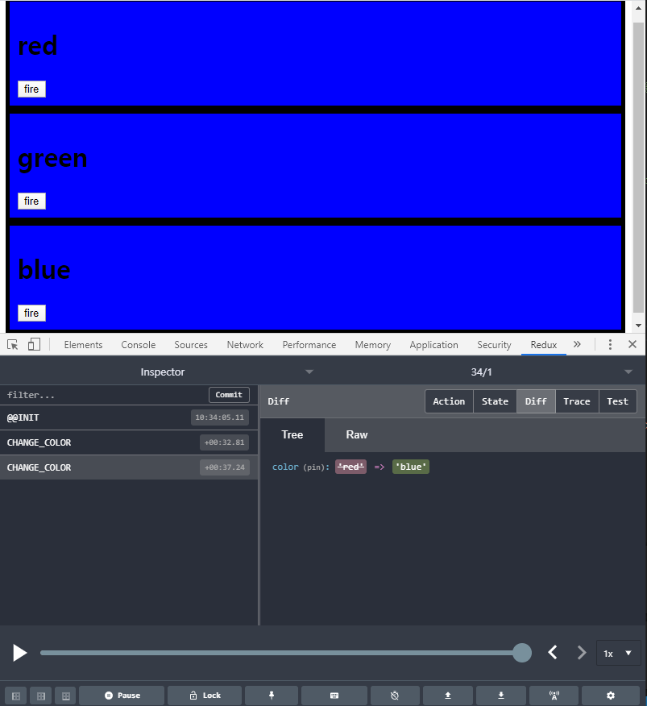

# with-redux

## 리덕스 설치법
방법1. npm install redux

방법2. https://cdnjs.cloudflare.com/ajax/libs/redux/리덕스버전/redux.js 링크 추가

## store 생성 및 reducer 정의
```javascript
//       이전 상태, 전달된 {type, payload}
reducer = (state, action) => {
    if(!state) //undefined
    {
        // 초기 state 값 설정
        return { color: 'yellow'}
    }
}

//store 생성
let store = Redux.createStore(reducer);
console.log(store.getState()); // print { color: 'yellow'}
```

## action으로 state 수정, reducer로 새로운 state 반환
```javascript
onClickFire = () => {
    store.dispatch({type:'CHANGE_COLOR', color: 'red'})
}

reducer = (state, action) => {
    if(!state) //undefined
    {
        // 초기 state 값 설정
        return { color: 'yellow'}
    }
    let newState;
    if(action.type === 'CHANGE_COLOR'){
        newState = Object.assign({}, state, {color:action.color}) //state 복사(시간 여행을 할 수 있도록 복사해야함.). 서로 의존을 하면 안 된다.
    }
    return newState; // 새로운 상태 반환
}

```
## subscribe으로 렌더 함수 등록
```javascript
red = () => {
    let state = store.getState();
    document.querySelector('#red').innerHTML = `
    <div class="container" id="component_red" style="background-color:${state.color}">
        <h1>red</h1>
        <input 
        type="button" 
        value="fire"
        onclick="store.dispatch({type:'CHANGE_COLOR', 'red'})">
    </div>
`;
}
//state가 변경될 때마다 자동으로 호출될 함수 등록
store.subscribe(red);
```

## [redux dev tools](https://github.com/zalmoxisus/redux-devtools-extension)
store의 내용을 시간을 이동하며 확인할 수 있는 툴<br>
뒤로 가기, 앞으로 가기 모두 동작한다.<br>
</img>

## 결론
red, green, blue 컴포넌트는 서로에 대해 참조하고 있지 않아도,<br>
store의 state값만으로 각자의 색을 변경할 수 있다.<br>
즉 자신의 일에만 집중할 수 있다.<br>
다시 말해 컴포넌트간 의존성을 낮출 수 있다.