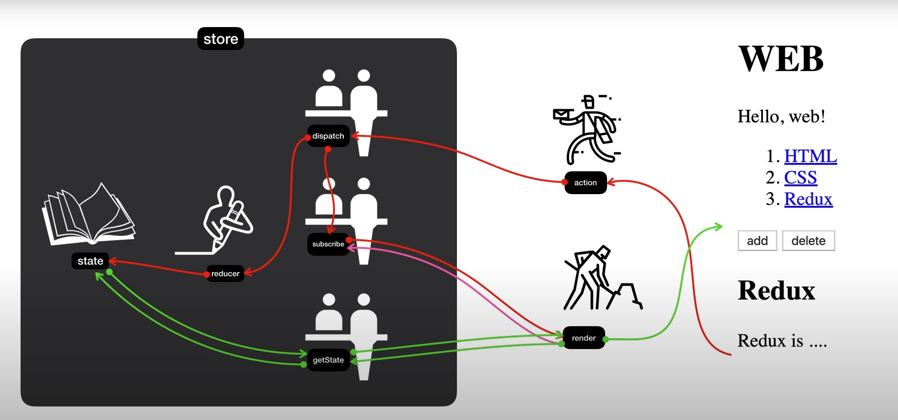

# Redux-Example

이 레포지토리는 [생활코딩의 Redux](https://www.youtube.com/playlist?list=PLuHgQVnccGMB-iGMgONoRPArZfjRuRNVc) 를 시청하고 정리한 것입니다.

## 리덕스란?
자바스크립트 앱을 위한 예측가능한 state 컨테이너.
> A predictable state container for JavaScript apps.

## 리덕스의 특징
1. 앱의 복잡성을 낮춘다.
2. 우리가 바라는대로 앱을 구현할 수 있게 된다.
3. 하나의 상태(객체)로 앱을 관리한다.
4. 상태를 변경하려면 직접 접근할 수 없고, 특정 함수를 호출해야만 한다.
5. 상태가 바뀔 때마다 그 상태를 참조하고 있는 개체들에게 메시지를 전송한다.
6. 변경하기 전의 상태, 바뀐 후의 상태를 디버깅으로 쉽게 볼 수 있다. REDO, UNDO를 쉽게 할 수 있다.

## 리덕스 맵
</img>

### store에 있는 요소들
1. state: 관리할 상태
2. reducer: store 바깥에서 액션을 취하면 파라미터로 이전의 state와 현재 요청한 action 객체가 넘어온다. state와 action을 이용해서 새로운 state 객체를 만들어서 리턴한다.
3. getState : render 함수에서 state값을 가져오기 싶을 때 사용한다.
4. subscribe: state가 바뀔 때마다 render 함수가 호출하도록 등록하는 함수이다.
5. dispatch: 1. reducer를 호출해서 state값을 바꾼다. 2. subscribe을 호출해서 구독자들 모두에게 render 함수를 호출한다.
### store 바깥에 있는 요소들
1. render: 현재 state를 반영하는 DOM을 렌더링하는 함수이다. getState를 호출하여 state를 가져온 뒤 DOM에 반영한다.
2. action: 비즈니스 로직과 state를 변경하는 로직이 합쳐진 코드를 말한다. dispatch를 통해 state를 변경 요청한다.
